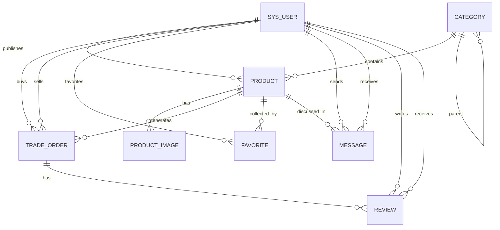

# 校园二手交易系统数据库设计说明

## 基本信息

- 学号：2415304249
- 题目：题目9：校园二手交易系统设计与实现
- 技术栈：Java、Spring Boot、MySQL 5.7、Redis、Vue、HTML、CSS、JavaScript
- 数据库：MySQL 5.7
- 中间件部署地址：MySQL `192.168.24.129:3307`，Redis `192.168.24.129:6379`

## 课程要求对应

- 至少 5 张表：已设计 9 张业务表。
- E-R 图：见 `campus_secondhand_market_er.mmd`。
- 关系模型：见本文“关系模型”。
- SQL 代码：见 `campus_secondhand_market.sql`。
- 视图：`v_on_sale_product`。
- 索引：`idx_product_search`，并在各表中按查询场景补充唯一索引和普通索引。
- 触发器：`trg_order_before_insert_validate_order`、`trg_order_after_insert_lock_product`、`trg_order_after_update_finish_product`。

## 需求分析

校园二手交易系统面向校内学生交易闲置物品，核心用户包括管理员、卖家、买家。

- 管理员：管理用户、商品分类、商品信息、交易记录。
- 卖家：发布商品、维护商品图片、处理订单、回复买家咨询。
- 买家：浏览商品、收藏商品、咨询卖家、下单购买、完成后评价。

## 功能设计

- 登录功能：前端 Vue 登录页提交用户名和密码，Spring Boot 查询 `sys_user`，登录态可放入 Redis。
- 商品管理：卖家发布、修改、下架商品，管理员可审核或管理商品。
- 分类管理：管理员维护商品分类，前端按分类筛选商品。
- 商品展示：前端首页查询 `v_on_sale_product`，显示在售商品、封面图、卖家信息。
- 订单管理：买家下单生成订单，下单前触发器校验商品状态；下单后触发器自动锁定商品；订单完成后触发器自动标记商品已售出。
- 收藏与消息：买家收藏商品，并围绕商品向卖家发送咨询消息。
- 评价管理：交易完成后买家或卖家对对方评价。

## 关系模型

- 用户表：`sys_user(id, username, password_hash, real_name, student_no, phone, email, role, status, avatar_url, last_login_at, created_at, updated_at)`
- 分类表：`category(id, name, parent_id, sort_no, status, created_at, updated_at)`
- 商品表：`product(id, seller_id, category_id, title, description, price, original_price, condition_level, trade_place, status, view_count, created_at, updated_at)`
- 商品图片表：`product_image(id, product_id, image_url, sort_no, created_at)`
- 交易订单表：`trade_order(id, order_no, product_id, buyer_id, seller_id, amount, status, buyer_remark, created_at, paid_at, finished_at, updated_at)`
- 收藏表：`favorite(id, user_id, product_id, created_at)`
- 消息表：`message(id, product_id, sender_id, receiver_id, content, is_read, created_at)`
- 评价表：`review(id, order_id, reviewer_id, target_user_id, score, content, created_at)`
- 操作日志表：`operation_log(id, biz_type, biz_id, action, detail, created_at)`

## 实体关系说明

- 一个用户可以发布多个商品，`sys_user.id` 对应 `product.seller_id`。
- 一个分类可以包含多个商品，`category.id` 对应 `product.category_id`。
- 一个分类可以有多个子分类，`category.id` 对应 `category.parent_id`。
- 一个商品可以有多张图片，`product.id` 对应 `product_image.product_id`。
- 一个商品可以产生订单，`product.id` 对应 `trade_order.product_id`。
- 一个用户可以买多个订单，也可以卖多个订单，分别对应 `trade_order.buyer_id` 和 `trade_order.seller_id`。
- 一个用户可以收藏多个商品，一个商品也可以被多个用户收藏，通过 `favorite` 维护多对多关系。
- 一个商品可以产生多条咨询消息，消息关联发送人和接收人。
- 一个订单可以产生评价，评价关联评价人与被评价人。

## Redis 使用建议

- Redis 地址：`192.168.24.129:6379`
- 登录态：`login:token:{token}` 保存用户登录信息。
- 商品缓存：`product:detail:{productId}` 缓存商品详情。
- 首页列表缓存：`product:list:{categoryId}:{page}` 缓存分类列表。
- 热门浏览计数：`product:view:{productId}` 缓存浏览量，再定时同步到 MySQL。

## Spring Boot 连接配置示例

```yaml
server:
  port: 8080

spring:
  datasource:
    driver-class-name: com.mysql.cj.jdbc.Driver
    url: jdbc:mysql://192.168.24.129:3307/campus_secondhand_market?useUnicode=true&characterEncoding=utf8&serverTimezone=Asia/Shanghai&useSSL=false
    username: campus_user
    password: Campus@2415304249
  data:
    redis:
      host: 192.168.24.129
      port: 6379
      database: 0
      timeout: 3000ms
```

## Vue 前端接口配置示例

```env
VITE_API_BASE_URL=http://localhost:8080/api
```

开发时 Vue 运行在本机，Spring Boot 连接虚拟机中的 MySQL `3307` 端口和 Redis `6379` 端口；如果 Spring Boot 也部署到虚拟机，可以把前端接口地址改为：

```env
VITE_API_BASE_URL=http://192.168.24.129:8080/api
```

## SQL 导入命令

```powershell
& "C:\Program Files\MySQL\MySQL Server 8.2\bin\mysql.exe" -h 192.168.24.129 -P 3307 -u root -p < campus_secondhand_market.sql
```

## 前端 Vue 页面建议

- 登录页：用户名、密码、登录按钮，调用 Spring Boot 登录接口。
- 首页商品列表：查询 `v_on_sale_product` 或对应接口，支持分类、价格排序、关键字搜索。
- 商品详情页：展示商品详情、图片、卖家信息、收藏和咨询入口。
- 发布商品页：填写标题、分类、价格、成色、交易地点、上传图片。
- 我的订单页：买家查看订单状态，卖家处理交易。
- 管理后台页：管理员维护用户、分类、商品和订单。

## E-R 图 Mermaid 源码


